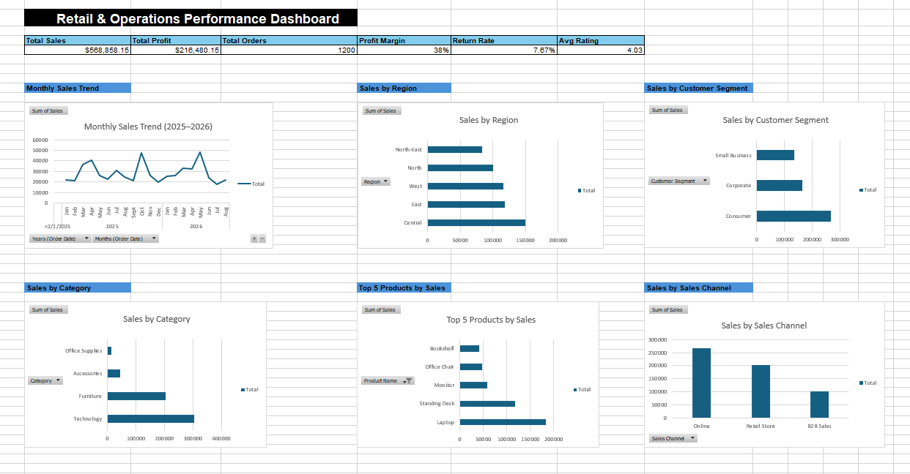

# Retail & Operations Excel Dashboard

## Project Overview

This project is an Excel-based business analysis dashboard designed to analyse retail and operational performance.

The dashboard uses Excel formulas, PivotTables, PivotCharts and lookup functions to transform raw sales data into clear business insights and KPI reporting.

## Key KPIs

- Total Sales: $568,858.15
- Total Profit: $216,480.15
- Total Orders: 1,200
- Profit Margin: 38%
- Return Rate: 7.67%
- Average Customer Rating: 4.03

## Dashboard Analysis

The dashboard includes:

- Monthly Sales Trend
- Sales by Region
- Sales by Category
- Top 5 Products by Sales
- Sales by Customer Segment
- Sales by Sales Channel
- Return Rate Analysis
- Average Customer Rating Analysis

## Excel Skills Demonstrated

- PivotTables
- PivotCharts
- VLOOKUP
- SUM and COUNT formulas
- IFERROR
- Data Validation
- Conditional Formatting
- Data Cleaning
- KPI Calculations
- Business Reporting
- Dashboard Design

## Business Insights

Key findings from the analysis include:

- Technology generated the highest sales among product categories.
- Consumer customers contributed the largest share of revenue.
- Online was the strongest-performing sales channel.
- Laptop was the highest-selling product.
- Overall return rate was 7.67%.
- Average customer rating was approximately 4.03 out of 5.

## Files

- `retail_operations_excel_dashboard.xlsx` — complete Excel workbook
- `dashboard_preview.png` — dashboard preview

## Dashboard Preview

## Author

Aye Chan Myat Phyo  
BSc (Hons) Data Science & Artificial Intelligence  
University of the West of England
